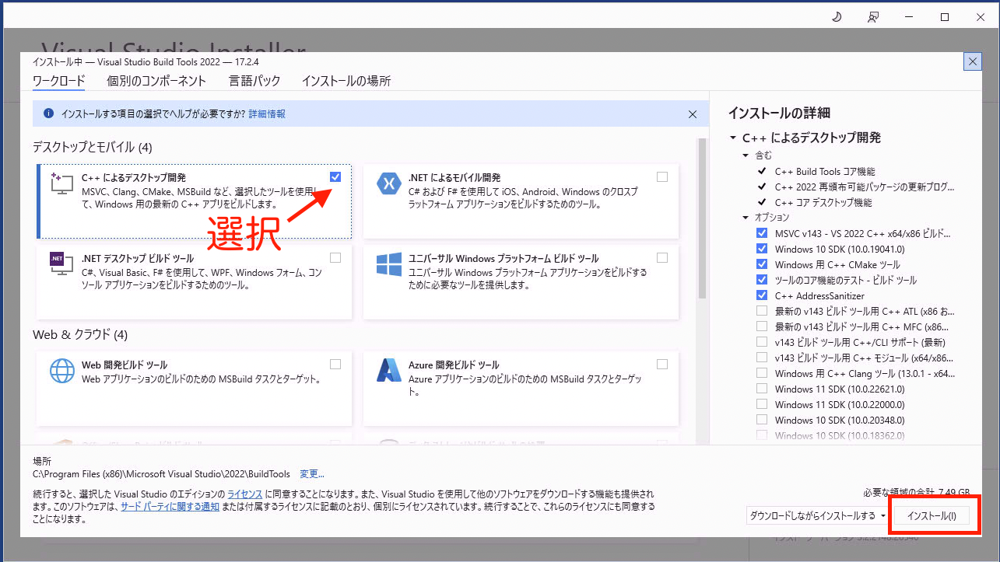

## ツール類のインストール
### MS Build tool
次のURLからMS Build toolのインストーラをダウンロードします。

<https://visualstudio.microsoft.com/ja/downloads/#build-tools-for-visual-studio-2022>

ダウンロードしたインストーラを起動し`C++によるデスクトップ開発`を選択してインストールボタンをクリックします。




### OpenCV
次のURLからOpenCVをダウンロードします。

<https://sourceforge.net/projects/opencvlibrary/files/4.6.0/opencv-4.6.0-vc14_vc15.exe/download>

自己解凍式のアーカイブなので、ダウンロードしたexeファイルを実行して展開します。

### POSIX Threads for Windows
次のURLから`pthreads-w32-2-9-1-release.zip`をダウンロードします。

<https://sourceforge.net/projects/pthreads4w/files/>

### python
次のURLにアクセスします。

<https://www.python.org/downloads/windows/>

"StableReleases" と書かれた側の最新バージョン(一番上のバージョン)のうち
"Windows installer"とかかれたexeファイルをダウンロードしてください。
32bit版と64bit版がありますので、お使いの環境に合わせて選んでください。

## darknetのビルド
次のURLにアクセスして`Code`と書かれたボタンをクリックし、`Download ZIP`を選択します。

<https://github.com/AlexeyAB/darknet>

ダウンロードしてきたzipファイルは適当な場所に展開しておいてください。

gitが使える環境の方は次のコマンドを実行してソースコードをcloneしても構いません。
```
git clone https://github.com/AlexeyAB/darknet.git
```
ソースディレクトリに移動してビルドします

`-DCMAKE_PREFIX_PATH`の後には、opencvのアーカイブを展開して生成されたディレクトリ内の`build`
ディレクトリのパスを指定してください。

```
cd darknet
mkdir build_release
cd build_release
cmake -DCMAKE_PREFIX_PATH=C:\Users\sogo\Desktop\opencv\build -DENABLE_CUDA=OFF ..
cmake --build . --target install
```

正常にビルドできたら、darknetディレクトリの直下に`darknet.exe`という実行ファイルが生成されているので確認しましょう。
```
ls -l ../darknet.exe
```

### ライブラリのパス設定
事前にダウンロードしたOpenCVとpthreadのdllファイルをdarknet.exeと同じディレクトリにコピーするか
それぞれ環境変数PATHに追加してください

OpenCV: `\opencv\build\x64\vc15\bin\opencv_world460d.dll`

pthread: `Pre-build.2\dll\x64\pthreadVC2.dll`

## labelImgのインストール
次のコマンドを実行します
```
pip install labelImg
```

最後に次のコマンドを入力してlabelImgが起動するか確認してください
```
labelImg
```
